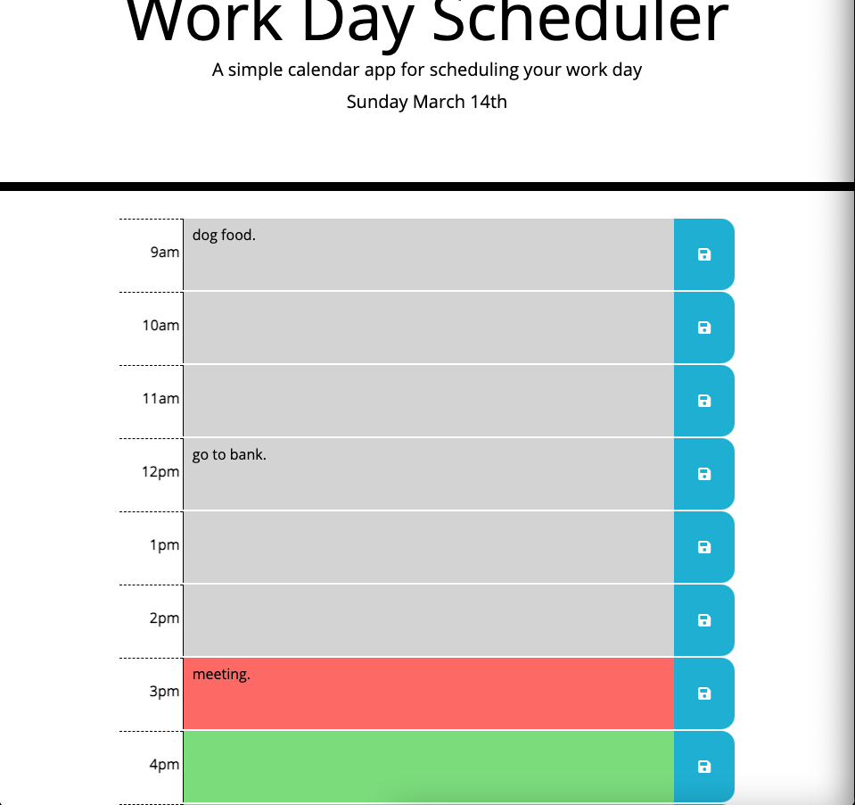

# Word Day Scheduler

# <Your-Project-Title>

## Description

I built this app so that the user would be able to plan and schedule their day and know what the current, past and present hours are. They can also enter plans in each of the text areas and it will be saved to their local storage in perpetuity. By doing this project I learned how to use the Moment.js library, and it helped me further understand that taking little bite sized steps is the best way to achieve the overall goal of the project.

You can visit the app [HERE](https://petermodavis.github.io/work-day-scheduler/)

## Usage

Just go to the link provided above, write a message in the text area and click on the associated save button. Then when you refresh, it will still be there.

## Credits

[Moment.JS](https://momentjs.com/)

## License

MIT License

Copyright (c) [2021] [Peter MoDavis]

Permission is hereby granted, free of charge, to any person obtaining a copy
of this software and associated documentation files (the "Software"), to deal
in the Software without restriction, including without limitation the rights
to use, copy, modify, merge, publish, distribute, sublicense, and/or sell
copies of the Software, and to permit persons to whom the Software is
furnished to do so, subject to the following conditions:

The above copyright notice and this permission notice shall be included in all
copies or substantial portions of the Software.

THE SOFTWARE IS PROVIDED "AS IS", WITHOUT WARRANTY OF ANY KIND, EXPRESS OR
IMPLIED, INCLUDING BUT NOT LIMITED TO THE WARRANTIES OF MERCHANTABILITY,
FITNESS FOR A PARTICULAR PURPOSE AND NONINFRINGEMENT. IN NO EVENT SHALL THE
AUTHORS OR COPYRIGHT HOLDERS BE LIABLE FOR ANY CLAIM, DAMAGES OR OTHER
LIABILITY, WHETHER IN AN ACTION OF CONTRACT, TORT OR OTHERWISE, ARISING FROM,
OUT OF OR IN CONNECTION WITH THE SOFTWARE OR THE USE OR OTHER DEALINGS IN THE
SOFTWARE.

## Badges

